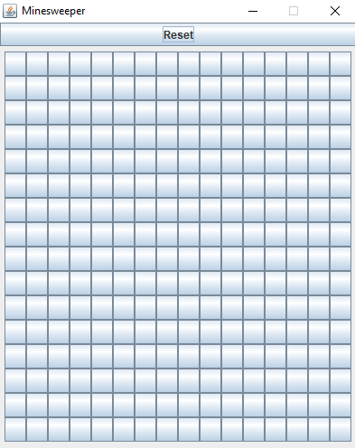
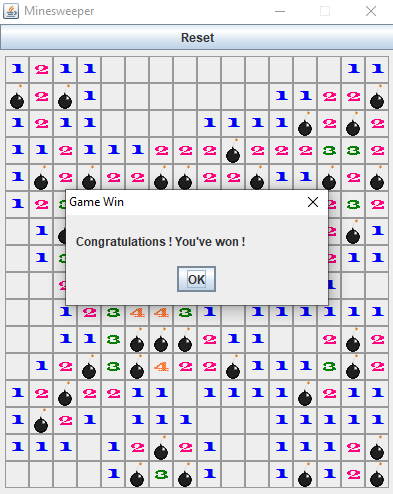
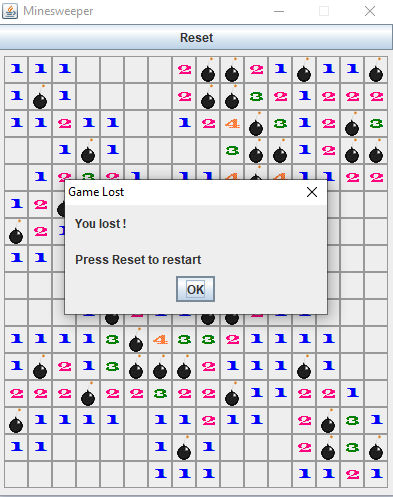

# Minesweeper
Minesweeper game that I've developed in Java.

# What I learned

* Recursion
* Object-Oriented Programming
* Data Structure
* Algorithms
* Encapsulation
* Packages / API

# Preview

